# Star Lattice

<p align="center">
  <a href="https://jacksonjp0311-gif.github.io/star-lattice/">
    
  </a>
</p>

<p align="center">
  <a href="https://jacksonjp0311-gif.github.io/star-lattice/">Open the live Star Lattice</a>
  ·
  <a href="https://github.com/jacksonjp0311-gif/star-lattice/actions">View workflows</a>
</p>

First-party, token-free GitHub star history for any public repository. The
lattice is a static SVG plus a live browser page backed by a committed JSON
snapshot. GitHub Actions collects stargazer timestamps with `gh`; GitHub Pages
serves the result same-origin, so browsers never need a GitHub token.

## What you get

- `site/index.html` — live lattice with cache-busted metric reloads.
- `site/star-lattice.svg` — README-safe static chart.
- `site/star-metrics.json` — browser-safe snapshot.
- Hourly refresh workflow and automatic GitHub Pages deployment.
- No npm, database, server, or third-party chart host.

## Use it in a new repository

1. Create a public GitHub repository, for example `owner/project-star-lattice`.
2. Clone this template and enter it:

   ```powershell
   git clone https://github.com/OWNER/STAR-LATTICE-REPO.git
   cd STAR-LATTICE-REPO
   ```

3. Edit `lattice.config.json`:

   ```json
   {
     "repository": "owner/project",
     "display_name": "Project",
     "default_branch": "main"
   }
   ```

4. Push to `main`.
5. In GitHub, open **Settings → Pages**, choose **GitHub Actions** as the
   source, and run **Actions → Refresh star lattice → Run workflow** once.
6. Your dashboard will be published at:

   `https://OWNER.github.io/STAR-LATTICE-REPO/`

The Pages workflow uses `configure-pages`, `upload-pages-artifact`, and
`deploy-pages`, so no branch named `gh-pages` or manual artifact upload is
needed.

## Add it to an existing repository

Keep this repository separate and publish its Pages site, then link it from
your project README:

```markdown
[Open the live star lattice](https://OWNER.github.io/STAR-LATTICE-REPO/)

```

For a single-repository setup, copy `site/`, `scripts/`,
`lattice.config.json`, and both workflows into the target repository. The
target repository must be public and its Actions workflow must have
**Settings → Actions → General → Workflow permissions → Read and write**.

## Local preview

```powershell
python scripts/build_star_lattice.py
python -m http.server 8765 --directory site
```

Open <http://127.0.0.1:8765/>. The build requires GitHub CLI and an authenticated
session (`gh auth login`) because GitHub does not expose `starred_at` to an
unauthenticated browser request.

## Trust and privacy

The browser receives only repository name, star count, timestamps, and update
time. No GitHub token is published. The workflows request only the permissions
needed to read repository metadata, write refreshed assets, and deploy Pages.

## Troubleshooting

- **Page shows an old count:** hard-refresh; the page adds a timestamp query to
  `star-metrics.json` on every load.
- **Refresh workflow fails:** confirm the repository is public, `GH_TOKEN` is
  available, and Actions can write contents.
- **Pages is blank:** choose **GitHub Actions** under Settings → Pages and
  rerun the Pages workflow.

Star Lattice is intentionally static, inspectable, and reusable.
